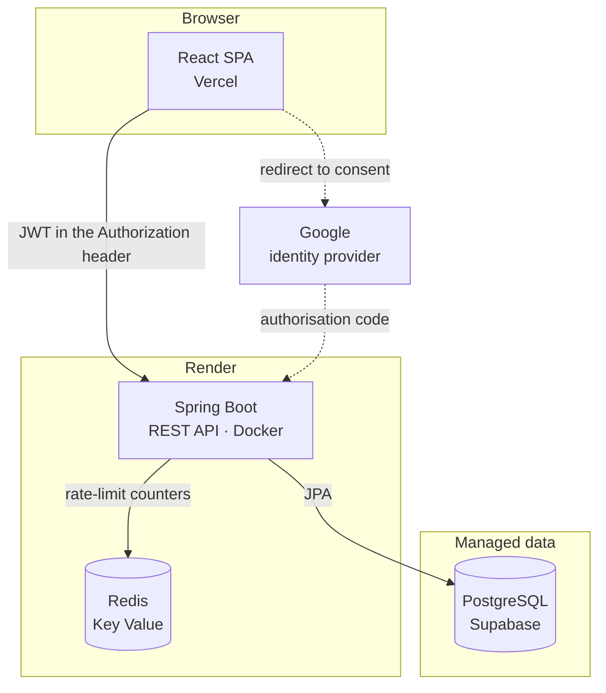

# match-skill

[](https://github.com/patrickpriebe/match-skill/actions/workflows/ci.yml)

A skill-bartering application: a Spring Boot REST API, a React SPA with its own
design system and its own translation layer, PostgreSQL and Redis on managed
infrastructure, and a deploy that happens on every push to `main`.

**Live: https://match-skill.vercel.app**

The whole project rests on a single decision: **complementary skills are not a
match — a match is two people who can actually meet.** Reciprocity and
time-zone overlap are not a filter bolted onto the list, they are what produces
the ordering, and a pair whose weekly windows never intersect is dropped from
the feed even when the skills line up perfectly. Everything else in this
repository exists to support that premise honestly.

---

## Table of contents

- [What it does](#what-it-does)
- [Architecture](#architecture)
- [Tech stack](#tech-stack)
- [The rule that is never broken](#the-rule-that-is-never-broken)
- [Matching and ranking](#matching-and-ranking)
- [The exchange lifecycle](#the-exchange-lifecycle)
- [Data model](#data-model)
- [Skill vocabulary and identity](#skill-vocabulary-and-identity)
- [Identity and security](#identity-and-security)
- [Frontend](#frontend)
- [Internationalisation](#internationalisation)
- [CI/CD](#cicd)
- [Cloud deployment](#cloud-deployment)
- [Running locally](#running-locally)
- [Testing strategy](#testing-strategy)
- [Engineering decisions worth reading](#engineering-decisions-worth-reading)
- [Known limits](#known-limits)
- [Documentation](#documentation)

---

## What it does

Someone signs in with Google, says what they can teach and what they want to
learn, records the hours they are free, and gets a ranked list of people who
complete the trade. From there it is a negotiation: a request, an acceptance
that names the skill going back the other way, a meeting link, and a rating
once it is over.

| Flow | What the person sees |
|---|---|
| Sign in | Google, or e-mail and password. Both land on the same session |
| Skills | Two lists — *I can teach*, *I want to learn* — with autocomplete over the shared vocabulary |
| Availability | Recurring weekly windows in a named time zone, not dates |
| Home | Ranked matches: mutual trades first, then reputation, then how many minutes a week both are free |
| Search | The same ranking, restricted to one chosen skill |
| Invitations | Requests received and sent, accepted by naming what the requester will teach |
| Scheduling | A date, a time and a meeting link, validated against a host allowlist |
| History | Completed and cancelled exchanges, each with its rating |
| Feedback | One rating per participant per exchange, and only after it is completed |

---

## Architecture



One deployable backend, one static frontend, two data stores with clearly
different jobs. There is no message broker and no second service: at this size
a queue would be a moving part with nothing to carry.

| Surface | Routes |
|---|---|
| `/api/auth` | `register`, `login`, `me`, `google`, `google/callback` |
| `/api/skills` | Search over the approved vocabulary, `suggest` a new entry |
| `/api/me/skills` | The signed-in person's offered and wanted lists |
| `/api/me/availability` | Weekly windows, replaced as a whole on `PUT` |
| `/api/matches`, `/api/search` | The ranked feed and the single-skill lookup |
| `/api/exchanges` | The lifecycle: create, accept, decline, schedule, complete, cancel, feedback |
| `/api/users/{id}` | Public profile and the feedback that person received |

The backend is layered, and the layering is enforced by review rather than by a
module system: `controller` → `service` → `repository` → `entity`, with `dto`
at the HTTP boundary. A controller never touches a repository and an entity
never crosses the wire.

---

## Tech stack

| Layer | Choice | Notes |
|---|---|---|
| Language | **Java 21** | Records for DTOs and value types, sealed switch, text blocks |
| Framework | **Spring Boot 3.3.4** | Web, Data JPA, Data Redis, Security, Validation |
| Tokens | **jjwt 0.12.6** | HS256, signed and validated in-process |
| Relational data | **PostgreSQL** | Hibernate, `ddl-auto: validate` in production |
| Counters | **Redis** | Fixed-window rate limiting, one Lua script |
| Identity | **Google OAuth 2.0** + local credentials | BCrypt for the local path |
| Frontend | **React 18** + **TypeScript 5.7** + **Vite 6** | React Router 7, `lucide-react`, `clsx`, `cva` |
| Translation | **Hand-written** | Two dictionaries and a context — about ninety lines of runtime |
| Tests | JUnit 5, Mockito, AssertJ, MockMvc, Vitest, Playwright | 311 backend, 28 frontend |
| CI/CD | **GitHub Actions** | Build, test, history-wide secret scan, image build |
| Hosting | **Render** (Docker) · **Vercel** · **Supabase** | Deploy on push to `main` |

---

## The rule that is never broken

> **A skill name is never translated.**

The interface speaks English and Portuguese. The vocabulary does not. A skill is
stored exactly as the person typed it, and it is rendered exactly that way to
everyone, in every locale, forever.

This is not laziness about translation — it is what keeps the vocabulary usable.
Translating `React` into a Portuguese label would fork one skill into two
entries that no longer match each other, and someone looking for a `React`
teacher would silently miss half the platform. The same argument applies to
`Violão`: rendering it as *Guitar* for an English reader merges two instruments
that are not the same thing, and the mistake only surfaces after the meeting.

So the translation dictionaries cover chrome — labels, buttons, empty states,
validation messages, relative dates — and nothing that came out of the database.
The rule is easy to state and easy to break by accident, which is exactly why it
is written down here.

---

## Matching and ranking

The feed is built from a handful of batched queries and then ranked in memory,
because the ordering combines four independent signals that no single SQL
expression states cleanly at this size.

**Who is a candidate.** Anyone who *offers* a skill the viewer *wants*. That
asymmetry is the point: a list of people with interesting skills is a directory,
not a match.

**How strong the match is.**

| Strength | Meaning |
|---|---|
| `MUTUAL` | They offer something I want **and** I offer something they want |
| `PARTIAL` | Only the first half holds — I would be receiving, not trading |

`PARTIAL` is kept rather than discarded because the person can still ask; it is
simply ranked below every mutual trade.

**The order**, in full:

1. `MUTUAL` before `PARTIAL`
2. Higher average rating
3. More ratings, so an unbroken 5.0 from one exchange does not outrank a 4.9
   from thirty
4. More overlapping minutes per week
5. User id, so the page boundary is stable across requests

**The availability filter.** Two complementary skill lists that never overlap in
time are not a usable match, and the feed drops them — but only once *both*
sides have actually recorded availability. Someone who has not filled in their
hours yet is still shown, because absence of data is not evidence of a conflict.

Overlap is computed by projecting each recurring weekly window onto a fixed
reference week in UTC, as minute-of-week ranges (`0..10079`), and intersecting
them. Windows that cross midnight after the conversion wrap around the end of
the week correctly. Comparing local clock times directly would have made a
Monday evening in São Paulo look like a conflict with a Monday evening in
Lisbon, which is four hours apart.

---

## The exchange lifecycle

```
              ┌──────────► DECLINED
              │
REQUESTED ────┴──► ACCEPTED ──► SCHEDULED ──► COMPLETED ──► feedback ×2
                       │            │
                       └────────────┴──────► CANCELLED
```

| Transition | Who may do it | What it requires |
|---|---|---|
| Create | Anyone but yourself | The receiver must actually offer the named skill |
| Accept | **Only the receiver** | Names the skill the requester will teach; it must be one they offer |
| Decline | **Only the receiver** | — |
| Schedule | Either participant | An instant and a meeting URL on the allowlist; allowed again from `SCHEDULED`, which is how rescheduling works |
| Complete | Either participant | Only from `SCHEDULED` |
| Cancel | Either participant | From `ACCEPTED` or `SCHEDULED` |
| Feedback | Either participant, once each | Only on a `COMPLETED` exchange |

Strength is recorded on the exchange at creation time rather than recomputed on
read. A trade that was mutual when it was agreed stays mutual in the history
even if one of the two later removes the skill.

Every state transition loads the row with a pessimistic lock
(`findByIdForUpdate`). Two participants pressing *complete* and *cancel* at the
same second is not exotic — it is the normal shape of a two-party interaction,
and without the lock both reads would see `SCHEDULED` and both writes would
succeed.

Meeting URLs are checked against a host allowlist — `zoom.us`,
`meet.google.com`, `teams.microsoft.com`, `whereby.com`. A free-text link field
in an application that pairs strangers is a phishing vector with a delivery
mechanism attached.

---

## Data model

| Table | Purpose |
|---|---|
| `users` | Identity, display name, bio, IANA time zone, optional BCrypt hash, optional Google subject |
| `skills` | The shared vocabulary: display name, slug, `identity_key`, status |
| `user_skills` | A person's link to a skill, with `direction` of `OFFERED` or `WANTED` |
| `availabilities` | Recurring weekly windows: day of week, start and end local time |
| `exchanges` | The negotiation: both participants, both skills, strength, status, scheduled time, meeting URL |
| `feedback` | One row per author per exchange: rating and comment |

Time zones are stored as IANA names on the user, never as offsets. An offset is
a fact about one instant; a person is in a place, and the place is what survives
a daylight-saving change.

An availability window belongs to a weekday and a local clock time, not to a
date. That is what makes it recurring, and it is also what forces the UTC
projection in the matcher rather than a simple comparison.

---

## Skill vocabulary and identity

The vocabulary is shared and typed by users, which means the same skill arrives
spelled several ways. Deduplication happens on a **normalised identity**, not on
the display name:

- Case folded and accents stripped through NFD, so `Violão`, `violao` and
  `VIOLÃO` are one skill.
- Unicode letters and digits preserved, so `日本語` is a skill and not an empty
  string.
- `+` and `#` escaped to `~2b` and `~23`, because `C++`, `C#` and `C` are three
  different things and a naive slug collapses them into one.
- Every other run of punctuation and whitespace becomes a single `-`.

The stored key is the SHA-256 of that identity — fixed width, safe for a unique
constraint, and indifferent to how long the name is. The human-readable slug is
the identity itself when it fits in 255 characters, and otherwise a truncated
prefix plus `--` plus the full digest. The doubled separator is reserved so a
generated fallback can never alias a legacy slug that is already taken.

**The display name is whatever the first person typed.** Later spellings resolve
to the same row without renaming it. The registered form is the canonical one,
which is the same rule the translation layer obeys from the other direction.

Insertion races are resolved by the unique constraint rather than by a prior
`SELECT`: the suggest path retries three times, re-reading the committed winner
after each `DataIntegrityViolationException`. It runs with
`Propagation.NOT_SUPPORTED` on purpose — inside a caller's transaction, the
first failed insert would poison it and every retry would read a snapshot from
before the competing commit.

---

## Identity and security

### Two ways in, one session

Google OAuth and local e-mail plus password both end at the same JWT. The
session is stateless — `SessionCreationPolicy.STATELESS`, no server-side store,
no CSRF token because there is no cookie to forge against.

The Google client registration is **conditional**: the beans only exist when
both the client id and the secret are configured. A local checkout with no
Google credentials boots cleanly with the button absent, rather than failing at
startup or offering a control that cannot work.

The authorisation-request resolver is scoped to exactly `GET /auth/google`.
Spring's default matcher is `/auth/{registrationId}`, which also swallows
`/auth/login` and `/auth/me` — a default that silently turns two working routes
into OAuth redirects.

### A failure has to land on the frontend

The API and the SPA are on different origins. When Google sign-in fails, the
browser is at the API's origin, and Spring Security's default behaviour is to
write a JSON error body there. Someone who tried to sign in got a bare
`{"code":"UNAUTHORIZED"}` on a white page — which is precisely what happened to
the first person who opened the link on a phone.

The failure handler now logs the exception and redirects to the SPA's
`/auth/callback`, which already renders a *sign-in failed, try again* state when
it arrives without a token. One screen owns the outcome, in both directions.

### Production refuses to boot half-configured

Under the `prod` profile a `BeanFactoryPostProcessor` checks that the JWT
secret, the database URL, user, password and `sslmode`, the Redis URL, the
allowed CORS origins and the OAuth redirect are all present — **before** any
client is created or any connection is opened. If Google credentials are set,
its redirect URI becomes mandatory too.

A missing variable is not allowed to degrade into a default. `sslmode` is the
clearest case: without the check, a forgotten variable is a database connection
that silently stops verifying the certificate, and nothing about the running
service looks wrong.

### Rate limiting fails closed

Login, registration and exchange creation are limited by a fixed window in
Redis — 5 per minute, 5 per minute, 20 per minute — incremented and expired in a
single Lua script so the `INCR` and the `EXPIRE` cannot be split by a crash.

When Redis is unreachable the request is **refused** with `503`, not allowed
through. An open door is worse than a closed one here: the whole point of the
limit is the moment the infrastructure is under stress, which is exactly when a
dependency is most likely to be down.

### Secrets

No credential lives in this repository, and a CI job proves it on every push by
scanning the **entire history** for credential formats — Google client secrets,
GitHub tokens, AWS keys, Postgres and Redis URLs with inline passwords, private
key headers. It prints the commit and the file and never the matching line,
because the log of a public repository is public too.

Hosts under `example.com`, `example.org` and `example.net` are filtered out:
they are reserved by RFC 2606 and are what the tests use to exercise URL
parsing. Filtering by host rather than by file path keeps a real leak detectable
even when it is committed inside a test.

---

## Frontend

```bash
cd frontend && npm install && npm run dev
```

React 18, TypeScript in strict mode, Vite, React Router. Thirteen screens, each
with a real URL.

- **A design system in CSS custom properties.** Tokens for colour, spacing,
  radius and type; components compose them. A component that writes its own hex
  value is a component no future theme reaches.
- **Two shells, one tree.** Desktop renders a sidebar, mobile a fixed bottom tab
  bar with `env(safe-area-inset-bottom)` padding and a matching bottom gutter on
  the page, so the last row of content is never parked under the bar.
- **Dialogs become bottom sheets under 920px** — full width, square bottom
  corners, anchored to the edge. A centred card with side margins on a phone is
  a desktop dialog that has been shrunk, not a mobile one.
- **`overflow-wrap: anywhere` is the global safety net, and the exceptions are
  explicit.** Long unbroken strings must not overflow a phone; but buttons,
  badges, time-zone names and metadata rows opt back out, because breaking
  `America/Sao_Paulo` mid-word makes the label unreadable to save a few pixels.

---

## Internationalisation

English and Portuguese, in about ninety lines of runtime: two dictionaries, a
context, a `t(key, vars)` with `{placeholder}` interpolation, and a fallback to
English for any key a translation is missing. `en.ts` exports its own shape as
`Dict`, so a key added to English and forgotten in Portuguese is a TypeScript
error rather than a blank label in production.

A library was considered and rejected. Plural rules, namespaces, lazy-loaded
bundles and an ICU parser are the reasons to reach for one, and this application
needs none of them — the two plural cases it has are spelled out as two keys.

The locale is chosen from `localStorage`, falling back to `navigator.language`,
and it sets `document.documentElement.lang`. Dates and times are formatted with
`Intl` under `en-GB` or `pt-BR`, so a Portuguese reader gets *sex., 25 de dez.*
and an English one gets a day-first date rather than the American ordering.

And the vocabulary is never touched. See
[the rule that is never broken](#the-rule-that-is-never-broken).

---

## CI/CD

**GitHub Actions.** The pipeline is in
[`.github/workflows/ci.yml`](.github/workflows/ci.yml) and runs on every push to
`main` and every pull request, with in-progress runs cancelled when a new commit
arrives.

| Job | What it does |
|---|---|
| **backend** | `./mvnw clean verify` on JDK 21 with Maven caching, uploading the surefire reports as an artifact even when the build is red |
| **frontend** | `npm ci`, lint, Vitest, and a production build with the same `VITE_API_BASE_URL` the deploy uses |
| **secrets** | Scans the entire git history for credential formats, with `fetch-depth: 0` |
| **image** | Builds the backend Docker image with Buildx — only after the tests pass, because an image of broken code should not exist |

The image job does not push to a registry. Render builds the deployed image from
this same Dockerfile; what CI proves is that the build works *before* the deploy
tries it.

The backend suite needs no service container: it runs against an in-memory
database and treats an absent Redis as unavailable, which the rate limiter
already handles by refusing.

A second workflow, [`keep-awake.yml`](.github/workflows/keep-awake.yml), pings
the backend every ten minutes during a daily window. It exists because of a real
constraint, described below, and it is a patch rather than a feature.

---

## Cloud deployment

| Piece | Provider | Notes |
|---|---|---|
| Frontend | **Vercel** | Auto-deploy on push; an SPA rewrite for everything that is not `/api` or an asset |
| Backend | **Render** | Docker runtime, auto-deploy on push, multi-stage build ending on a JRE as uid 10001 |
| Database | **PostgreSQL on Supabase** | Session pooler, `sslmode=verify-full` |
| Counters | **Redis on Render Key Value** | Private URL inside the Render network |
| Identity | **Google Cloud** | Published OAuth consent screen, so anyone can sign in |

Three constraints shaped this setup, and they are the kind of thing that only
shows up once you actually deploy:

- **The direct Supabase connection is IPv6-only** and Render's egress is IPv4.
  The session pooler is not a performance choice here, it is the only address
  that resolves.
- **`ddl-auto: validate` cannot create a schema.** The first deploy failed with
  *"Schema-validation: missing table [availabilities]"* against an empty
  database. The schema was created by setting `update` for exactly one deploy
  and then removing the override — because leaving it on means a renamed field
  silently adds a column instead of failing loudly.
- **Free instances sleep after fifteen minutes.** Measured cold start on this
  service: **71 seconds** from the first request to the first response. Someone
  opening the link in that window sees a dead page and concludes the site is
  broken — which is exactly what happened. The scheduled ping keeps it awake
  during a seven-hour daily window, which is 210 of the 750 monthly instance
  hours the whole workspace shares. On a paid instance the file would not need
  to exist.

The Vercel build runs `scripts/validate-hosted-env.mjs` before `vite build`, so
a hosted deploy that still carries the local relative API default fails at build
time instead of shipping a bundle that points at nothing.

---

## Running locally

Docker for the infrastructure, JDK 21 and Node 22 for the applications.

```bash
docker compose up -d
```

Brings up PostgreSQL on `5432` and Redis on `6379`.

```bash
cd backend && ./mvnw spring-boot:run
```

```bash
cd frontend && npm install && npm run dev
```

| Service | Address | Credentials |
|---|---|---|
| API | http://localhost:8080/api | — |
| Frontend | http://localhost:5173 | — |
| PostgreSQL | `localhost:5432` | `matchskill` / `matchskill` |
| Redis | `localhost:6379` | — |

These are local development credentials and are good for nothing else.

The default profile uses `ddl-auto: update`, so the schema appears on first
boot. Google sign-in is simply absent without credentials; the e-mail and
password form works on its own.

---

## Testing strategy

**311 backend tests** across 28 classes, and **28 frontend tests**.

| Area | What is covered |
|---|---|
| Services | Every branch of the exchange lifecycle, including who is forbidden from each transition |
| Matching | Strength classification, the full ranking order, and the availability filter across time zones |
| Overlap | Windows that cross midnight, wrap the week, and sit in zones with different DST rules |
| Identity | Accents, `C++` versus `C#`, non-Latin scripts, the fallback slug, and insertion races |
| Security | Boot-time refusal of an incomplete production configuration; the OAuth failure redirect; the scoped authorisation resolver |
| Rate limiting | The window boundary, and the refusal when Redis is down |
| Frontend | The API client's error mapping, availability arithmetic, meeting-URL rules and scheduling helpers, under Vitest |

Playwright is wired for browser tests (`npm run test:browser`) and is not part
of the CI gate.

Some tests exist to stop one specific thing from recurring: that the OAuth
failure path redirects rather than writing JSON, that production refuses to boot
without `sslmode`, and that a rate-limit check with no Redis raises rather than
returns `true`.

---

## Engineering decisions worth reading

A few choices that are easy to get wrong and were deliberate here.

**Ranking in memory, and saying where that stops working.** The candidate set
for one skill is loaded, sorted and then sliced. That is honest at a few hundred
candidates per skill and wrong at tens of thousands, where the ranking has to
move into the query. The limit is written in the class comment rather than
discovered later under load.

**Pessimistic locks on state transitions, not optimistic retries.** Two people
act on the same exchange at the same time by design, not by accident. A version
column would turn that into a retry loop around a decision a human already made.

**Strength is stored, not recomputed.** History has to say what the trade was
when it was agreed. Recomputing it on read means a completed exchange quietly
changes its own past when someone edits their skill list.

**The vocabulary is keyed by a hash, not by the name.** A unique constraint on a
user-supplied string is a constraint on its length, its collation and its
normalisation form. A SHA-256 of the normalised identity is fixed width and has
none of those properties.

**Auto-approval of new skills, because no approver exists.** Suggestions were
created as `PENDING_REVIEW` by a workflow whose second half was never built:
there is no moderation endpoint and no moderation screen anywhere in the
codebase. The status stayed, the queue grew, and a new user's first action put
them in front of a wall. New suggestions are now `APPROVED` on creation. That is
the honest state of the feature rather than a moderation story the code does not
tell — and the gap is recorded in [docs/planning.md](docs/planning.md).

**Redis refuses rather than allows.** See above; it is the one place in this
codebase where the failure mode was chosen against availability on purpose.

---

## Known limits

Recorded so they do not look like oversights.

- **There is no moderation.** Any string that contains a letter or digit and
  fits in 100 characters becomes part of the shared vocabulary immediately. The
  identity scheme keeps duplicates from multiplying; it does nothing about
  nonsense or abuse.
- **Nobody is notified of anything.** No e-mail, no push, no in-app badge. A
  request sits in *Invitations* until the other person happens to open the site.
  There is no mail sender in the project at all.
- **There is no password reset.** The local login path can create an account and
  sign in, and a forgotten password is unrecoverable. Google sign-in is the
  route that actually works, which is why it is the primary button.
- **The meeting link is a link.** The application does not create the Zoom or
  Meet room, does not check that the URL resolves, and does not know whether
  anyone showed up. Completion is an assertion by a participant.
- **A completed exchange is never verified.** Either side can mark an exchange
  complete alone and then rate it, so reputation rests on two people who agreed
  to meet, not on evidence that they did.
- **A meeting can be scheduled in the past.** The instant is required and the
  URL is checked, but nothing rejects a date that has already gone by. The
  frontend picker does not offer one; the API accepts it.
- **Free-tier hibernation is papered over, not solved.** The scheduled ping
  covers a daily window. Outside it, the first visitor still waits about a
  minute.
- **In-memory ranking has a ceiling**, stated above and not yet reached.

---

## Documentation

- [Deployment readiness](docs/deployment-readiness.md) — what had to be true before this went live
- [Planning](docs/planning.md) — scope, and the gaps that are known rather than hidden
- [Project status](docs/project-status.md) — where each area stands
- [Integration contracts](docs/backend-integration-contracts.md) — the request and response shapes the SPA depends on
- [Test plan](docs/test-plan.md) — what the suite is meant to guarantee
- [AGENTS.md](AGENTS.md) — the working rules for this repository

> Code, identifiers, comments and documentation are written in English. The
> interface speaks English and Portuguese. Skill names are written in whichever
> language they were registered, and are never translated into either.
