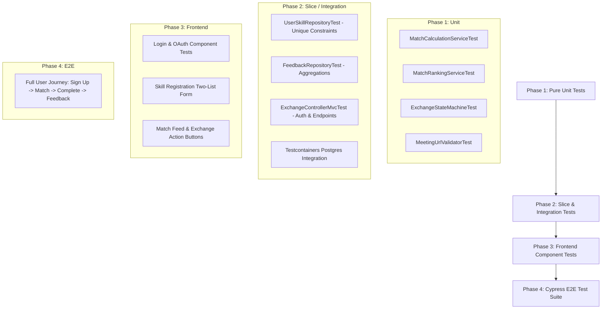

# Match Skill - Phase 1 Test Plan: Core Business Rules & Verification Strategy

## 1. Overview & Strategy

This test plan defines the testing architecture and test specifications for **Match Skill**, derived directly from the system specification in [`docs/documentation.md`](documentation.md).

Because the codebase is initially empty while the backend implements scaffold, entities, and auth, and the frontend builds Login and Skill Registration, this document formalizes all high-risk business logic upfront. Tests can be written or code verified immediately upon module delivery following a Test-Driven Development (TDD) or Test-First approach.

### Testing Pyramid & Tooling Stack

| Layer | Framework / Tools | Scope & Focus | Target Execution Time |
|---|---|---|---|
| **Unit Tests (Backend)** | JUnit 5, Mockito, AssertJ | Isolated business logic in `@Service` and utility components. No Spring context. | < 50ms per test |
| **Slice Tests (Backend)** | `@DataJpaTest`, `@WebMvcTest`, Testcontainers | JPA repository constraints, custom JPQL queries, web layer authorization. | < 150ms per test |
| **Integration Tests (Backend)** | `@SpringBootTest`, Testcontainers PostgreSQL (`@ServiceConnection`) | End-to-end backend flows, transactional boundaries, event listeners. | < 500ms per test |
| **Unit / Component Tests (Frontend)** | Jest, React Testing Library, Mock Service Worker (MSW) | Component rendering, state updates, validation forms, action gating. | Fast (< 100ms) |
| **End-to-End (E2E)** | Cypress | Full user journey across browser, API, and database. | Full suite (< 3m) |

---

## 2. High-Risk Business Rules & Test Matrices

### 2.1 Rule 1: Match Strength Calculation (`MUTUAL` vs `PARTIAL`)

**Definition:**
- A match candidate exists when another user **offers** a skill the current user **wants**.
- `MUTUAL`: The other user offers a skill the current user wants **AND** the current user offers a skill the other user wants.
- `PARTIAL`: The other user offers a skill the current user wants, but the current user offers **nothing** on the other user's wanted list.
- No match: When the other user offers nothing that the current user wants.

#### Test Cases (Unit: `MatchCalculationServiceTest`)

| Case ID | Current User Offered | Current User Wanted | Target User Offered | Target User Wanted | Expected Result |
|---|---|---|---|---|---|
| `MATCH-STR-01` | `[Java]` | `[React]` | `[React]` | `[Java]` | `MUTUAL` |
| `MATCH-STR-02` | `[Java, Spring]` | `[React, CSS]` | `[React, TypeScript]` | `[Java]` | `MUTUAL` (multiple overlapping skills) |
| `MATCH-STR-03` | `[Java]` | `[React]` | `[React]` | `[Python]` | `PARTIAL` |
| `MATCH-STR-04` | `[Java]` | `[React]` | `[React]` | `[]` (empty) | `PARTIAL` (target has not listed wanted skills yet) |
| `MATCH-STR-05` | `[Java]` | `[React]` | `[Python]` | `[Java]` | `NO_MATCH` (target does not offer what user wants) |
| `MATCH-STR-06` | `[Java]` | `[React]` | `[Python]` | `[Go]` | `NO_MATCH` |
| `MATCH-STR-07` | `[Java]` | `[Java]` | `[Java]` | `[Java]` | Self-match prevented: target must be `targetUserId != currentUserId` |
| `MATCH-STR-08` | `[Java]` | `[React]` | `[React (PENDING)]` | `[Java]` | `NO_MATCH` (`PENDING_REVIEW` skill excluded) |

---

### 2.2 Rule 2: Match Ranking & Ordering (`MUTUAL` > `PARTIAL`, Reputation, Availability Overlap)

**Definition:**
Matches on the home feed (`/api/matches`) and search results must be strictly ordered by:
1. `MUTUAL` matches **always** precede `PARTIAL` matches.
2. Within the same strength tier, order by **Reputation Score** descending (higher rating first; tie-break by total rating count descending).
3. If reputation is identical (or unrated), order by **Availability Overlap** descending (total overlapping weekly hours between the two users' recurring windows, normalized to UTC).

#### Test Cases (Unit & Slice: `MatchRankingServiceTest`, `MatchRepositoryTest`)

| Case ID | Candidate | Match Strength | Reputation Avg (Count) | Weekly Availability Overlap | Expected Rank Position |
|---|---|---|---|---|---|
| `RANK-01` | User A | `PARTIAL` | 5.0 (20) | 10 hrs | 3rd (behind all `MUTUAL`) |
| `RANK-02` | User B | `MUTUAL` | 4.2 (10) | 2 hrs | 2nd |
| `RANK-03` | User C | `MUTUAL` | 4.9 (15) | 1 hr | 1st (MUTUAL + highest reputation) |
| `RANK-04` | User D | `MUTUAL` | 4.9 (15) | 5 hrs | Ahead of User C (identical reputation, higher overlap) |
| `RANK-05` | User E | `PARTIAL` | Unrated / 0.0 (0) | 8 hrs | 5th |
| `RANK-06` | User F | `PARTIAL` | 3.5 (4) | 1 hr | 4th (higher than unrated User E) |

---

### 2.3 Rule 3: Exchange State Machine & Participant Authorization

**Definition:**
An Exchange transitions strictly across:
`REQUESTED` $\to$ (`DECLINED` | `ACCEPTED`) $\to$ `SCHEDULED` $\to$ `COMPLETED` (or `CANCELLED` from `ACCEPTED`/`SCHEDULED`).

**Actors:**
- `requesterId`: User who initiated the exchange request.
- `receiverId`: User who received the exchange request.
- `otherUser`: Any 3rd-party authenticated user (must be rejected with HTTP 403 Forbidden).

#### Valid Transitions & Authorization Matrix

| Action Endpoint | From Status | Allowed Caller | Required Payload | Next Status | Terminal? |
|---|---|---|---|---|---|
| `POST /api/exchanges` | None | Requester | `receiverId`, `skillFromReceiverId` | `REQUESTED` | No |
| `POST /api/exchanges/{id}/accept` | `REQUESTED` | **Receiver ONLY** | If `PARTIAL`: `skillFromRequesterId`. If `MUTUAL`: none required | `ACCEPTED` | No |
| `POST /api/exchanges/{id}/decline` | `REQUESTED` | **Receiver ONLY** | None | `DECLINED` | **Yes** |
| `POST /api/exchanges/{id}/schedule` | `ACCEPTED` | **Either** Requester or Receiver | `scheduledAt` (future ISO timestamp), `meetingUrl` | `SCHEDULED` | No |
| `POST /api/exchanges/{id}/complete` | `SCHEDULED` | **Either** Requester or Receiver | None | `COMPLETED` | **Yes** |
| `POST /api/exchanges/{id}/cancel` | `ACCEPTED` or `SCHEDULED` | **Either** Requester or Receiver | Optional reason | `CANCELLED` | **Yes** |

#### Invalid Transitions & Security Violations (Must Return 400 Bad Request / 403 Forbidden / 409 Conflict)

| Case ID | Current Status | Attempted Action | Actor | Expected Failure |
|---|---|---|---|---|
| `EXCH-ERR-01` | `REQUESTED` | `POST /accept` | Requester | `403 Forbidden` ("Only receiver can accept") |
| `EXCH-ERR-02` | `REQUESTED` | `POST /accept` | 3rd Party User | `403 Forbidden` |
| `EXCH-ERR-03` | `REQUESTED` | `POST /decline` | Requester | `403 Forbidden` ("Only receiver can decline") |
| `EXCH-ERR-04` | `REQUESTED` | `POST /schedule` | Receiver | `409 Conflict` ("Cannot schedule before acceptance") |
| `EXCH-ERR-05` | `REQUESTED` | `POST /complete` | Requester | `409 Conflict` ("Cannot complete an unaccepted exchange") |
| `EXCH-ERR-06` | `DECLINED` | `POST /accept` | Receiver | `409 Conflict` ("Terminal state cannot be modified") |
| `EXCH-ERR-07` | `COMPLETED` | `POST /cancel` | Requester | `409 Conflict` ("Completed exchange cannot be cancelled") |
| `EXCH-ERR-08` | `CANCELLED` | `POST /schedule` | Receiver | `409 Conflict` ("Cancelled exchange cannot be scheduled") |
| `EXCH-ERR-09` | `ACCEPTED` (PARTIAL) | `POST /accept` | Receiver | `400 Bad Request` if `skillFromRequesterId` is missing |
| `EXCH-ERR-10` | `ACCEPTED` (PARTIAL) | `POST /accept` | Receiver | `400 Bad Request` if `skillFromRequesterId` is not in requester's offered skills |
| `EXCH-ERR-11` | `ACCEPTED` | `POST /schedule` | 3rd Party User | `403 Forbidden` |

---

### 2.4 Rule 4: `meetingUrl` Allowlist & HTTPS Security Validation

**Definition:**
- Meeting links shared during `/api/exchanges/{id}/schedule` must prevent open-redirect and phishing attacks.
- Protocol: **Must** be `https://` (`http://`, `javascript:`, `data:`, etc. are rejected).
- Domain: Server-side check against a configured allowlist of meeting providers (e.g. `zoom.us`, `*.zoom.us`, `meet.google.com`, `teams.microsoft.com`, `whereby.com`).
- Allowlist must be injected via external Spring Configuration (`@ConfigurationProperties`), allowing dynamic updates without code recompilation.

#### Test Cases (Unit: `MeetingUrlValidatorTest` using `@ParameterizedTest`)

| Case ID | Input URL | Allowlist Configured | Valid? | Rejection Reason |
|---|---|---|---|---|
| `URL-01` | `https://meet.google.com/abc-defg-hij` | `[meet.google.com, zoom.us]` | **Yes** | Valid Google Meet link |
| `URL-02` | `https://us04web.zoom.us/j/123456789` | `[zoom.us, *.zoom.us]` | **Yes** | Subdomain match on Zoom |
| `URL-03` | `https://teams.microsoft.com/l/meetup-join/19...` | `[teams.microsoft.com]` | **Yes** | Valid Teams link |
| `URL-04` | `https://whereby.com/room-name` | `[whereby.com]` | **Yes** | Valid Whereby link |
| `URL-05` | `http://meet.google.com/abc-defg-hij` | `[meet.google.com]` | **No** | Insecure scheme (HTTP disallowed) |
| `URL-06` | `https://evil-zoom.us/j/123` | `[zoom.us]` | **No** | Unauthorized domain |
| `URL-07` | `https://zoom.us.attacker.com/j/123` | `[zoom.us]` | **No** | Subdomain spoofing attempt |
| `URL-08` | `javascript:alert(1)` | `[zoom.us]` | **No** | Malicious protocol |
| `URL-09` | `https://meet.google.com@attacker.com` | `[meet.google.com]` | **No** | Userinfo URL confusion |
| `URL-10` | `""` or `null` or `"   "` | Any | **No** | Empty/blank URL |

---

### 2.5 Rule 5: Unique Constraint `(exchangeId, authorId)` in Feedback

**Definition:**
- Each participant (`authorId`) can submit feedback for a specific exchange (`exchangeId`) at most **once**.
- Feedback can **only** be submitted if the exchange status is `COMPLETED`.
- Only the requester or the receiver of that exchange can author feedback.

#### Test Cases (Slice: `FeedbackRepositoryTest`, Unit: `FeedbackServiceTest`)

| Case ID | Exchange Status | Author | Existing Feedback in DB? | Expected Result |
|---|---|---|---|---|
| `FB-01` | `COMPLETED` | Requester | None | **Success** (Feedback created) |
| `FB-02` | `COMPLETED` | Receiver | None | **Success** (Feedback created) |
| `FB-03` | `COMPLETED` | Requester | Already submitted by Requester | `409 Conflict` / `DataIntegrityViolationException` (Unique violation) |
| `FB-04` | `COMPLETED` | 3rd Party User | None | `403 Forbidden` ("Author is not a participant of this exchange") |
| `FB-05` | `SCHEDULED` | Requester | None | `400 Bad Request` / `IllegalStateException` ("Cannot review non-completed exchange") |
| `FB-06` | `CANCELLED` | Receiver | None | `400 Bad Request` ("Cannot review cancelled exchange") |

---

### 2.6 Rule 6: Reputation Score Aggregated ONLY on `COMPLETED` Exchanges

**Definition:**
- A user's public reputation consists of:
  - `reputationScore`: Average rating (1.0 to 5.0) of feedback directed at this user.
  - `ratingCount`: Total count of feedback ratings.
- Aggregation query **must join** the `Exchange` entity and filter strictly on `exchange.status = 'COMPLETED'`.
- A user who has no completed exchanges or no feedback has `reputationScore = null` (or 0.0) and `ratingCount = 0`.

#### Test Cases (Slice: `FeedbackRepositoryTest` with Testcontainers PostgreSQL)

| Case ID | User | Feedback Ratings Received | Associated Exchange Statuses | Expected Aggregation |
|---|---|---|---|---|
| `REP-01` | User A | `[5, 4, 5]` | All `COMPLETED` | Score: `4.67`, Count: `3` |
| `REP-02` | User B | `[5]` on `COMPLETED`, `[1]` on `CANCELLED` (corrupted) | 1 `COMPLETED`, 1 `CANCELLED` | Score: `5.0`, Count: `1` (Non-completed ignored) |
| `REP-03` | User C | `[]` | No feedback | Score: `null` / `0.0`, Count: `0` |
| `REP-04` | User D | `[1, 2, 3, 4, 5]` | All `COMPLETED` | Score: `3.0`, Count: `5` |

---

### 2.7 Rule 7: Unique Constraint `(userId, skillId, direction)` in UserSkill

**Definition:**
- A user cannot register the identical skill with the same direction (`OFFERED` or `WANTED`) more than once.
- However, the same user **CAN** hold the same skill in **both** directions (`OFFERED` and `WANTED`) simultaneously (e.g. someone offering beginner level while wanting advanced mentoring).

#### Test Cases (Slice: `UserSkillRepositoryTest` with Testcontainers)

| Case ID | User | Skill | Direction | Existing DB Records | Expected Result |
|---|---|---|---|---|---|
| `USK-01` | User 1 | Java | `OFFERED` | None | **Success** |
| `USK-02` | User 1 | Java | `WANTED` | `(User 1, Java, OFFERED)` | **Success** (Dual direction allowed) |
| `USK-03` | User 1 | Java | `OFFERED` | `(User 1, Java, OFFERED)` | `DataIntegrityViolationException` (Duplicate constraint violation) |
| `USK-04` | User 1 | Java | `WANTED` | `(User 1, Java, WANTED)` | `DataIntegrityViolationException` (Duplicate constraint violation) |
| `USK-05` | User 2 | Java | `OFFERED` | `(User 1, Java, OFFERED)` | **Success** (Different user) |

---

### 2.8 Rule 8: `PENDING_REVIEW` Skills Excluded from Matching

**Definition:**
- New skill terms submitted via `/api/skills/suggest` enter the system with status `PENDING_REVIEW`.
- Only skills with status `APPROVED` participate in autocomplete, search, and match calculations.
- If a user offers or wants a `PENDING_REVIEW` skill, it must produce **no matches** until an administrator promotes it to `APPROVED`.

#### Test Cases (Unit & Slice: `SkillServiceTest`, `MatchServiceTest`)

| Case ID | Skill Status | Search / Autocomplete Action | Match Engine Action | Expected Behavior |
|---|---|---|---|---|
| `SKL-01` | `APPROVED` | Queried in `/api/skills?query=react` | Evaluated in matching engine | Returned in results; matches generated |
| `SKL-02` | `PENDING_REVIEW` | Queried in `/api/skills?query=vue` | Excluded from matching engine | Not returned in autocomplete; 0 matches generated |
| `SKL-03` | Promoted from `PENDING_REVIEW` to `APPROVED` | Queried after update | Evaluated immediately | Dynamic matching triggered; matches now appear |

---

## 3. Phased Execution Roadmap

### Phase 1: Immediate Unit Tests (JUnit 5 + Mockito + AssertJ)
- Implement pure domain and service tests as soon as service interfaces or entities are stubbed in `backend/`.
- Zero Spring context overhead (<50ms execution).
- Focus on:
  - `MatchCalculationService`: `calculateStrength(userSkills, targetSkills)`
  - `MatchRankingService`: sorting comparators (`MUTUAL` vs `PARTIAL`, reputation score, availability window intersection)
  - `MeetingUrlValidator`: regex and hostname matching against configured allowlist
  - `ExchangeService`: state transition guards and participant authorization checks

### Phase 2: Slice & Integration Tests (Spring Boot Test + Testcontainers)
- Once JPA repositories and Spring controllers are committed:
  - `@DataJpaTest` with real PostgreSQL via `@ServiceConnection` to validate database-enforced unique constraints:
    - `uk_feedback_exchange_author (exchange_id, author_id)`
    - `uk_user_skill_direction (user_id, skill_id, direction)`
    - Native / JPQL reputation aggregation queries
  - `@WebMvcTest` for `/api/exchanges/**` to verify HTTP status codes, security filter chain, and error response payload shape (`code`, `message`).

### Phase 3: Frontend Component Tests (Jest + React Testing Library)
- As frontend screens emerge in `frontend/`:
  - `Login.test.tsx`: Form validation, submit handlers, redirect based on `skillsRegistered` boolean.
  - `SkillRegistration.test.tsx`: Two-list selection (`OFFERED` vs `WANTED`), autocomplete chips, submission to `PUT /api/me/skills`.
  - `ExchangeCard.test.tsx`: Correct action buttons displayed depending on status and role (e.g. `Accept` / `Decline` shown only to receiver).

### Phase 4: Full E2E Flow (Cypress)
- Run once backend and frontend are wired end-to-end:
  1. User 1 registers via `/auth/register` $\to$ sets skills (Offers: Java, Wants: React).
  2. User 2 registers $\to$ sets skills (Offers: React, Wants: Java).
  3. User 1 navigates to `/` $\to$ verifies User 2 listed as `MUTUAL` match.
  4. User 1 clicks **Request Exchange**.
  5. User 2 logs in $\to$ sees invitation $\to$ clicks **Accept**.
  6. User 2 sets date/time and meeting URL (`https://meet.google.com/xyz-test`).
  7. Either user clicks **Complete**.
  8. User 1 submits Feedback (5 stars + comment).
  9. Verify User 2's profile shows updated reputation score (5.0, 1 review) and exchange listed in History.

---

## 4. Definition of Done & Quality Gates

In alignment with [`AGENTS.md`](../AGENTS.md):
1. **Zero Failing Tests**: Build must compile cleanly and all test suites must pass (`mvn test` / `npm test`).
2. **Deterministic & Isolated**: No static mutable state, no order dependence, dynamic ports for any mock servers (WireMock), clean database state per test method.
3. **No `@DirtiesContext`**: Slice tests must preserve cached Spring application contexts for optimal execution speed.
4. **Coverage Targets**: Minimum 90% branch coverage on high-risk domain services (`MatchService`, `ExchangeService`, `FeedbackService`).
